# Перечень компонентов

- Automaton server (AS) - предоставляет API для доступа к control plane процессов, обеспечивает вызов процессоров 
по расписанию и в соответствии с retry policy, обеспечивает персистентность (+ отправляет оповещения в Kafka)
- Automaton client (AC) - взаимодействует с AS, инициирует старт (Start) и восстановление (Repair) процессов, осуществляет
передачу событий в процесс (Call, Notify), возвращает состояние процесса (Get), удаляет процесс (вместе с историей, Remove)
- Processor server (PS) - реализует бизнес-логику (выбор шага процесса и сами шаги), предоставляет API для доступа
к бизнес логике
- Processor client (PC) - взаимодействует с PS, осуществляет вызовы (ProcessCall, ProcessRepair) и отправку сигналов 
(ProcessSignal) в процессы

Примечание: MG реализует компоненты Automaton server и Processor client. Компоненты Processor server и Automaton client 
реализуются в сервисе-процессоре, а также могут быть реализованы раздельно

# Сценарии

## Стандартный жизненный цикл

### Старт экземпляра процесса
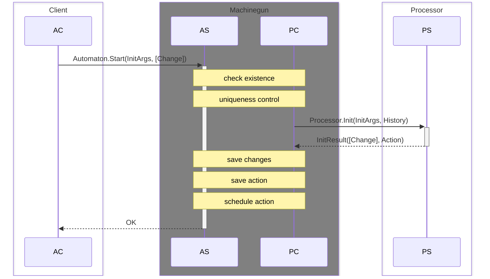

### Старт экземпляра процесса - ошибка - уже существует
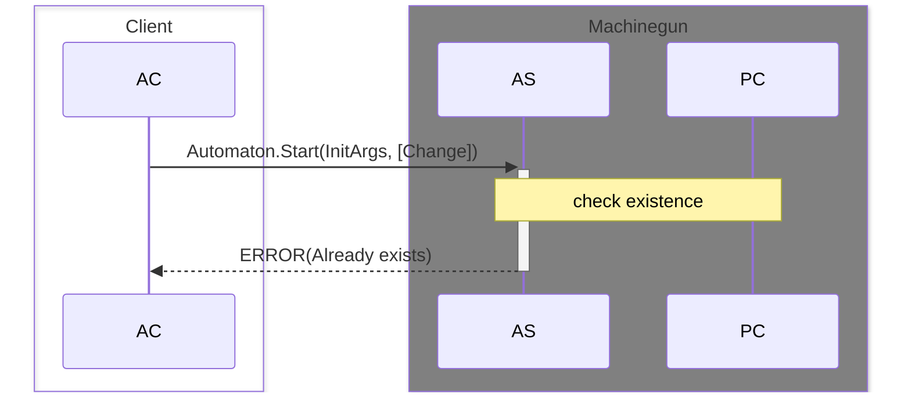

### Старт экземпляра процесса - ошибка процессора
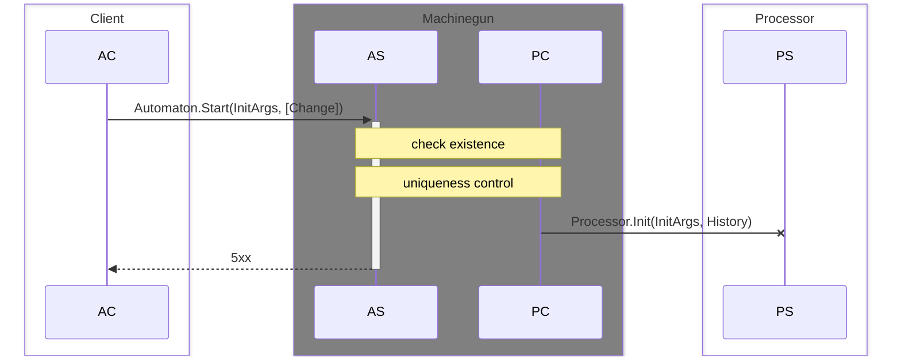

### Срабатывание таймера
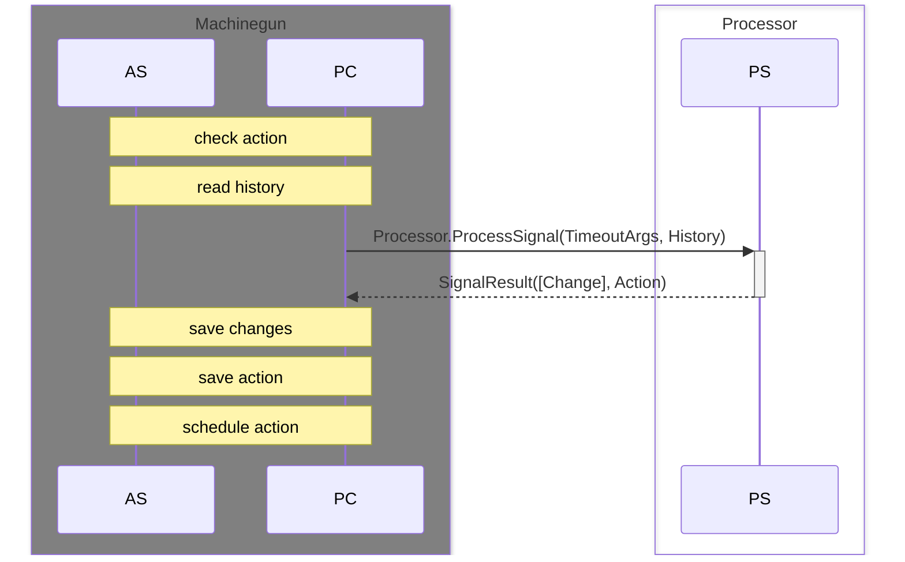

### Срабатывание таймера - ошибка процессора (обрабатываемая)
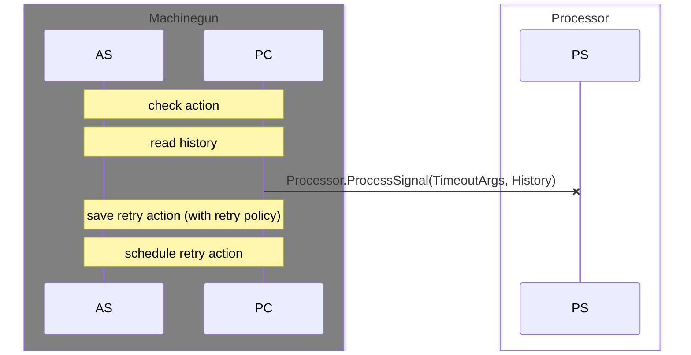

### Срабатывание таймера - ошибка процессора (необрабатываемая)
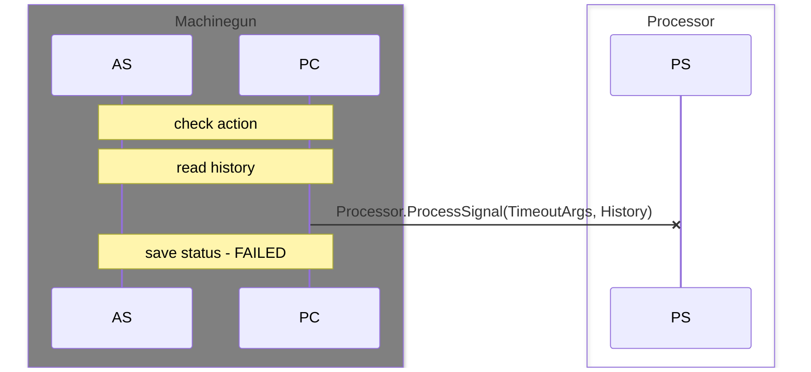

### Вызов процесса
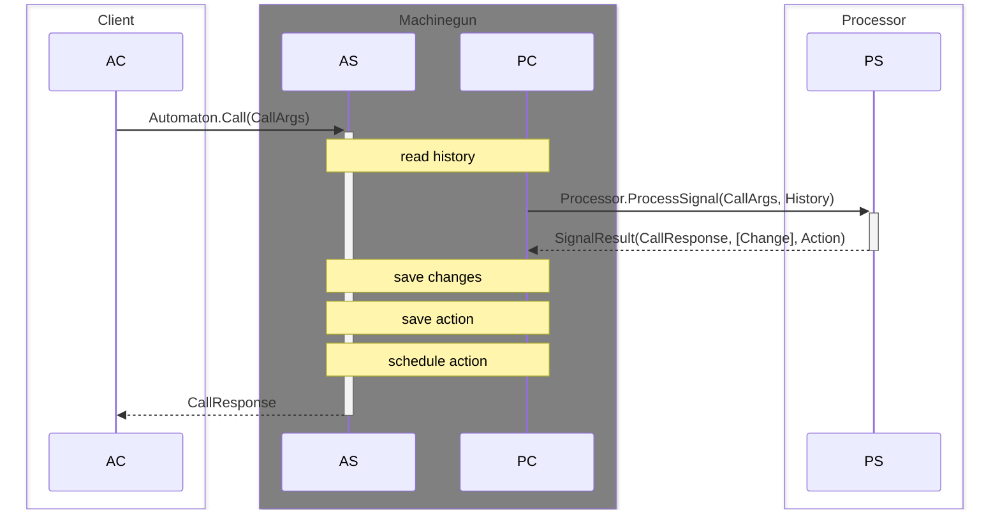

### Вызов процесса - ошибка процессора (обрабатываемая)
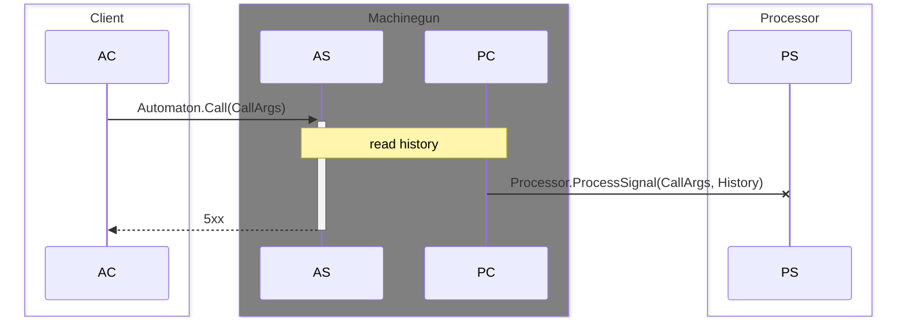

### Вызов процесса - ошибка процессора (необрабатываемая)
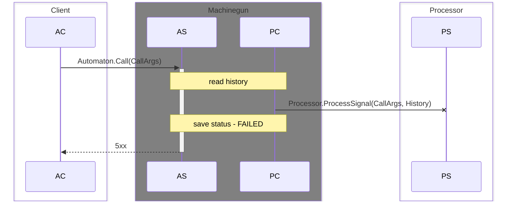

### Запланировать нотификацию процесса
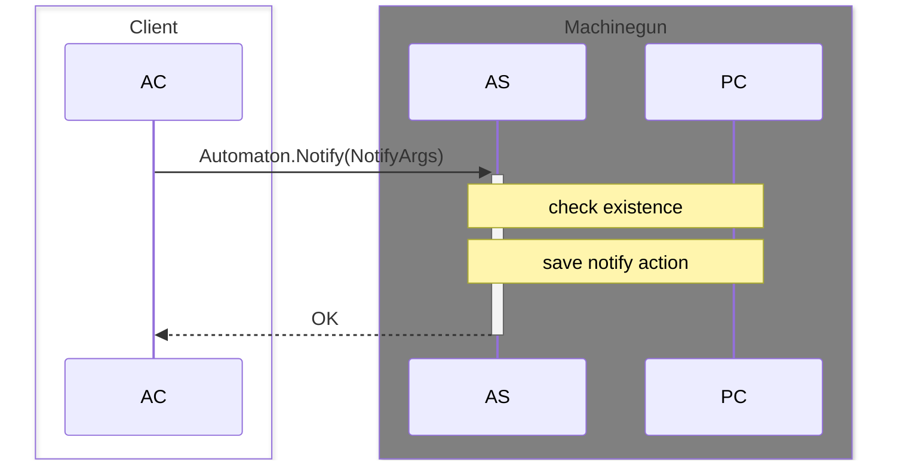

### Запланировать нотификацию процесса - ошибка получателя нотификации не существует
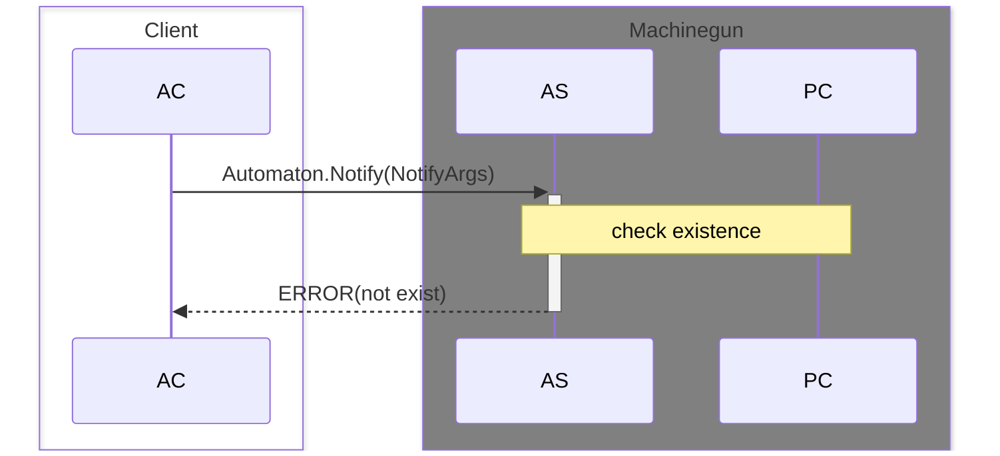

### Получение нотификации процессом
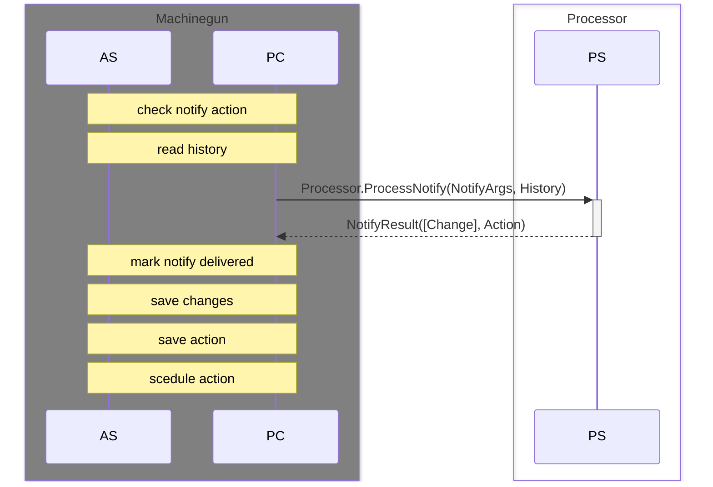

### Получение нотификации процессом - ошибка процессора (обрабатываемая)
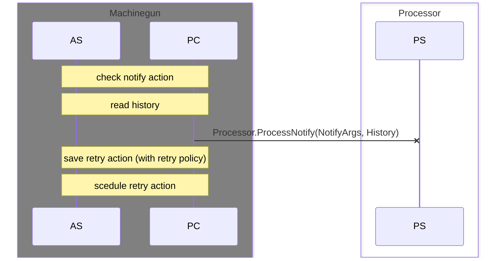

### Получение нотификации процессом - ошибка процессора (необрабатываемая)

### Получение history процесса
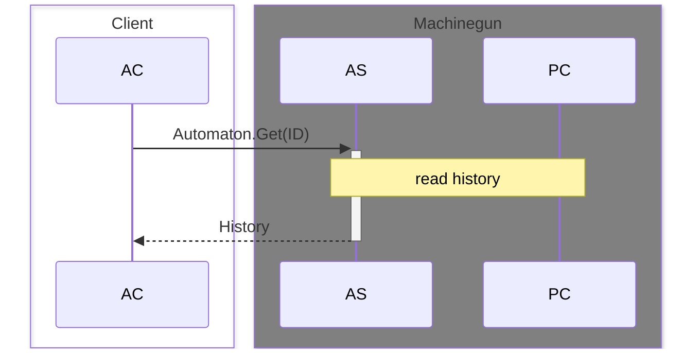

### Получение history процесса - ошибка - нет данных
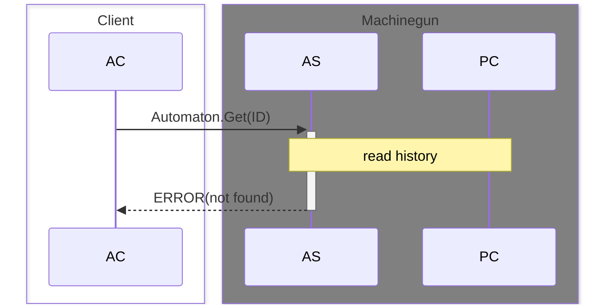

### Удаление history процесса

### Удаление history процесса - ошибка - нет данных
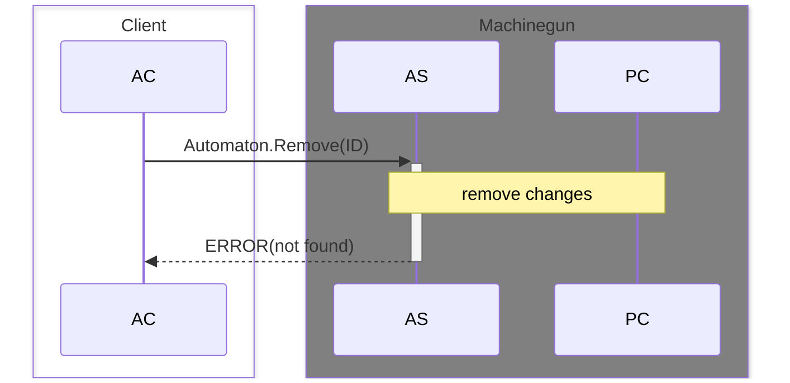

## Сбои и восстановление процессов

### Обрабатываемый (временный) сбой в работе процесса
> **Тоже самое что и таймер = 0**

### Восстановление после обрабатываемого сбоя процессора (with retry policy)
> **Тоже самое что и таймер = следующий шаг стратегии повтора**

### Необрабатываемый сбой в работе процесса
> **Переход процесса в статус FAILED**

### Восстановление после необрабатываемого сбоя процессора (repairing)
> **Тоже самое что и вызов процесса, при успехе статус FAILED переходит в другой**

### Внутренний сбой управляющей машины
> **Неожиданная выгрузка при убивании ноды**

### Восстановление после внутреннего сбоя управляющей машины
> **Вычитка всех процессов не имеющих финального статуса по запросу в базу**